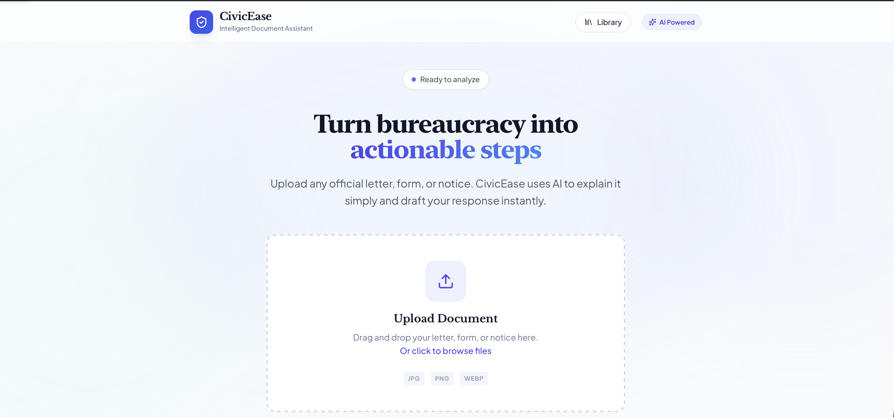
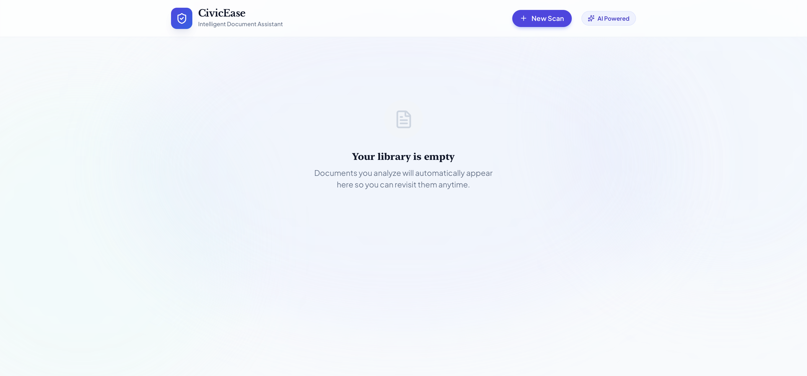

\# 🛡️ CivicEase - Intelligent Document Assistant

> **Decode fine print. Detect hidden charges. Simplify bureaucracy.**

CivicEase is an AI-powered document analysis platform designed to help everyday users understand complex legal and bureaucratic documents in seconds. Powered by **Google's Gemini 1.5 Pro**, it automatically flags predatory clauses, financial risks, and jargon.



## 🚀 Mission
Bureaucracy is broken. Loans, rental agreements, and insurance policies are written to be confusing. CivicEase bridges the gap between institutions and individuals by turning "Legalese" into "Plain English."

## ✨ Key Features
- **🔍 Risk Detection:** Instantly identifies hidden charges, variable interest rates, and auto-renewal traps.
- **💬 Context-Aware Chatbot:** Ask questions like *"Can my landlord evict me?"* and get answers based strictly on *your* uploaded document (RAG Architecture).
- **⚡ Instant Summaries:** Reduces document comprehension time by ~80%.
- **🔒 Privacy First:** Built on Google Cloud Platform (GCP) with ephemeral data processing—no user data is used for model training.

## 🛠️ Tech Stack
- **Frontend:** React.js (Vite), Tailwind CSS
- **Backend Logic:** Python, Node.js
- **AI Model:** Google Gemini 1.5 Pro (via Gemini API)
- **Infrastructure:** Google Cloud Platform (GCP)

## 📸 Screenshots
| Upload Interface | Analysis Dashboard |
|:---:|:---:|
|  |  |

## ⚙️ Run Locally

Prerequisites: **Node.js** and a **Gemini API Key**.

1. **Clone the repository**
   ```bash
   git clone [https://github.com/HARSHRAO729/CivicEase.git](https://github.com/HARSHRAO729/CivicEase.git)
   cd CivicEase

2. Install dependencies:

   npm install
   
3. Set up Environment Variables Create a .env file in the root directory and add your API key:

   VITE_GEMINI_API_KEY=your_api_key_here

4. Start the Development Server;

   npm run dev

👥 The Team

Harsh Rao - Co-Founder & Lead Engineer (www.linkedin.com/in/harsh-rao-dev)
Purva Patel - Co-Founder & Product Lead (www.linkedin.com/in/purva-patel-955767376)

Built with ❤️ for the Google AI Studio Challenge.
   
